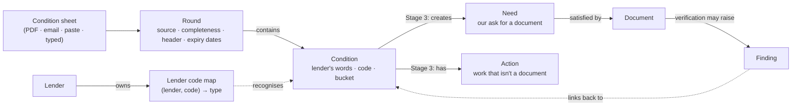

# Phase 4.5 — what a condition is, and what it is not

**Status:** Stage 0 · LP-903 · 2026-09-23
**Decisions:** ADR-403 … ADR-407 in [`../../decisions.md`](../../decisions.md)

This file exists because four things in this product are easy to confuse and expensive to merge: a
**condition**, a **need**, an **action** and a **finding**. The diagram is the short answer; the table
under it is the one to read when a later ticket is tempted to collapse two of them.

## The four things, and the question each answers

| | Answers | Whose words | Who ends it | Table |
|---|---|---|---|---|
| **Condition** | "What did the lender demand?" | the lender's, verbatim | **only the lender** (ADR-404) | `conditions` |
| **Need** | "What document are we still waiting for?" | ours, rewritable | a document that satisfies it | `needs_items` |
| **Action** | "What work isn't a document?" | ours | doing it (Stage 3) | `condition_actions` (Stage 3) |
| **Finding** | "What did our rules notice?" | the rule engine's | the reconciler, across runs | `findings` |

## The arrows that do not exist

Worth stating, because each is a plausible-looking edge that would be wrong:

- **Need → Condition.** A satisfied need does not clear a condition. The document may be exactly what
  was asked for and the underwriter may still reject it; we do not know until the lender says so
  (ADR-404).
- **Condition → Finding.** A condition is never minted as a finding. Findings are rule-derived and the
  reconciler owns their lifecycle; a row it must not retire has no business in the table it sweeps
  (ADR-406).
- **Finding → Condition.** A finding does not become a condition either. The dotted arrow is a
  **link**, added in Stage 3, so a processor can see that the statement we asked for on condition
  `6132` is the one that raised a new-deposit finding.
- **Global code → Condition.** There is no cross-lender code table. `7086` is short funds at UWM and
  means nothing at Champions; the map is `(lender, code)` (ADR-407).

## What Stage 1 does and does not touch

Stage 1 gets conditions **in** and stops there.

| Stage 1 does | Stage 1 never does |
|---|---|
| stores the round, its source and completeness | changes `prep_status` or `lender_status` |
| stores each condition in the lender's exact words | clears, removes or merges away a condition |
| keeps the code, category, bucket and underwriter notes | decides who acts on it (a hint only) |
| keeps the rest of the letter — team, figures, expiry dates | compares rounds or proposes "probably cleared" |
| records every state change as a `condition_event` | shows any status control, anywhere |

The last row is the one to hold on to. A partial paste cannot remove anything, a new round cannot
close anything, and nothing in Stage 1 writes a verdict — so the worst outcome of a bad parse is a row
a processor has to fix, never a condition that silently disappeared.
