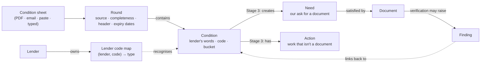

# Phase 4.5 — Stage 0 and Stage 1: build spec for Claude Code

> **Kick-off prompt** (paste into Claude Code at the repo root):
> *"Read `docs/phases/phase4.5-stage0-1-build-spec.md` end to end, then follow it. Start with §2
> (branch and numbering) and §3 (the survey). Build one ticket at a time in the order in §4, and
> stop at every point marked **STOP AND ASK**."*

**Status:** ready to build · 2026-09-23
**Parent plan:** `docs/phases/phase4.5-build-plan.md` (v3) — this file is the executable slice of its
Stage 0 and Stage 1.
**Tickets:** LP-903 (Stage 0) · LP-904 … LP-910 (Stage 1) · **ADRs:** 403 … 407
**Screens:** `docs/design/phase4.5-conditions/` — 13 reference screens (PNG + HTML) with a
*Must match* checklist each. Every UI ticket is checked against them (§6 LP-909, §11).

---

## 1. What you are building, in one screen

A mortgage processor at a processing company gets **condition sheets** from wholesale lenders (UWM,
Champions Funding, later Sun West) after underwriting. Each sheet lists **conditions** — things the
lender needs before it will close the loan. Today she retypes them. After Stage 1 she can:

1. **Upload** the lender's PDF on the file's Conditions tab, or **forward** the lender's email to the
   file's inbox address, or **paste** conditions copied from the lender portal, or **type one in**;
2. **review** what was read — every condition beside the lender's exact words — and fix anything;
3. **import**, which saves one **round** (that sheet) and its **conditions** with the lender's exact
   wording, code, bucket and category, plus the rest of the letter (lender team, loan figures, dates,
   the lender's own document-expiry table).

Stage 1 **does not** work conditions (no status board, no asks, no clearing) — that is Stages 2–3.
Stage 1 **never** clears, removes or merges away a condition.

### Vocabulary (add these to `docs/glossary.md` in LP-903)

| Term | Meaning |
|---|---|
| **Condition** | One requirement the lender issued, e.g. *"Provide copy of invoice for credit report."* |
| **Condition sheet** | The lender's document listing the conditions (UWM: "Loan Approval Conditions"; Champions: "Conditional Approval Certificate"). |
| **Round** | One condition sheet received for a file. Round 1 is the first approval; later rounds are re-issues after the processor submits documents. |
| **Lender code** | The lender's own ID for a condition template (UWM `7086` = short funds to close). **Only meaningful per lender** (ADR-407). |
| **Bucket** | The heading a condition is listed under — when it must be satisfied: Master · Prior to Docs (PTD) · Prior to Funding (PTF) · lender-internal ("Underwriter To Obtain And Clear") · trailing. |
| **Underwriter note** | A dated note the underwriter appends inside the condition text, e.g. `**8/28 Not in Upload`. It means the condition came back. |
| **Source / completeness** | How a round arrived (PDF, email, pasted, typed) and whether it is the lender's **full list** or **just some**. |

---

## 2. Branch and numbering

- Work on a new branch **`phase4.5-conditions`** cut from **`phase4-with-ui`** — Stage 1's email path
  depends on Phase 4's inbound pipeline (`AttachmentDisposition.CORRESPONDENCE`, triage), which lives
  there. **STOP AND ASK** if `phase4-with-ui` is not the branch the product owner wants.
- Ticket numbers **LP-903 … LP-910** and ADR numbers **403 … 407** were chosen to be free on both
  `phase4-with-ui` (tickets to LP-859, ADRs to 401) and `raspberrypi-work` (tickets LP-900–902, ADR
  402). Verify with `ls docs/tickets` and `grep "^## ADR-" decisions.md` before using them; if any is
  taken, **STOP AND ASK**.
- Every ticket gets `docs/tickets/LP-XXX.md` (what was done, assumptions, decisions), as the repo
  requires. CI must stay green: ruff, mypy strict, pytest, biome, tsc, build.

---

## 3. The survey (do this first, write it down)

Before any code, read the files below and write **`docs/tickets/phase4.5-survey.md`**, in the style of
`docs/tickets/phase4-survey.md`. For each item record *what exists, its exact name/signature, and how
Stage 1 will use it*. This spec names things as they were seen during planning; **the survey is the
source of truth** — where the code differs from this spec, follow the code and note the difference.

| Area | Read | Answer in the survey |
|---|---|---|
| Conventions | `CLAUDE.md`, `docs/project-structure.md`, `docs/development-workflow.md`, the last 10 ADRs in `decisions.md` | Where models, schemas, services, api, tasks, ai prompts and frontend hooks go; ADR format |
| Base model | `backend/app/models/base.py`, `helpers.py`, `types.py`, `enums.py` | Mixin names (UUID, timestamps, soft delete), how `company_id` is declared, how string enums are stored (`str_enum`?), `MediumStr` etc. |
| Append-only precedent | `models/finding_event.py` and its tests | How append-only is enforced and tested — copy it for `condition_events` |
| Encryption / NPI | `models/encrypted_types.py`, `docs/querying-staging.md`, wherever the `readonly.*` views are defined | How to exclude columns from the staging views (ADR-405) |
| Loan file, lender | `models/loan_file.py` (`inbox_token`, `lender_id`, `legal_hold`), `models/lender.py`, `models/lender_contact.py` | Is `lenders` company-scoped? What fields exist? |
| Documents and storage | `models/document.py`, `storage/base.py`, `services/documents.py`, `services/pdf_utils.py` | How a file is stored and referenced; which PDF library is installed and whether it gives **word positions** |
| Rasterize / OCR | `services/page_render.py`, `services/page_ocr.py`, `services/attachment_safety.py` | How to rasterize and OCR pages; how uploads are sniffed and sanitised |
| Inbound email | `models/inbound_message.py`, `models/inbound_attachment.py`, `services/inbound_ingest.py`, `api/inbound.py`, `frontend/app/(protected)/inbound` | What `CORRESPONDENCE` does today: is the file stored? linked to the loan file? what does triage show? |
| Tasks and locks | `tasks/celery_app.py`, `tasks/document_processing.py`, `tasks/needs.py` (`loan_file_needs_lock`, `task_session`) | How a task gets a DB session; the per-file lock |
| AI | `ai/client.py` (`complete()`), `ai/prompt_loader.py`, `ai/prompts/`, `ai/rate_limit.py`, `ai/cost.py`, config model settings | How to add a prompt file, call the model, record cost; which setting names hold model ids |
| Activity | `models/activity_log.py`, `services/activity_log.py`, `services/timeline.py` | Activity types (is it a Postgres enum needing a migration?) |
| Frontend | `app/(protected)/loan-files/[id]/conditions/page.tsx`, `components/file/tab-placeholder.tsx`, `components/file/needs/*`, `lib/api/*`, `components/ui/*`, `app/globals.css` | Page pattern, API hook pattern, table/dialog/sheet components, Ledger tokens |

**Done when** the survey file is committed and every row above has an answer.

---

## 4. Order of work

| # | Ticket | Depends on | Notes |
|---|---|---|---|
| 1 | Survey | — | §3 |
| 2 | **LP-903** ADRs + glossary + boundary diagram | survey | no code |
| 3 | **LP-904** data model + migrations | LP-903 | |
| 4 | **LP-910** lender code map seed | LP-904 | small; the readers use it |
| 5 | **LP-906** layout readers (pure functions + tests) | LP-910 | no DB, no API — the biggest ticket |
| 6 | **LP-905** upload + forward + parse task | LP-904, LP-906 | |
| 7 | **LP-907** paste | LP-905 | |
| 8 | **LP-908** AI structure split | LP-907 | |
| 9 | **LP-909** review + import (API and UI) | LP-905, LP-907 | frontend can start once LP-905's response schema is merged |

---

## 5. Stage 0 — LP-903: decisions

No code. Add five ADRs to `decisions.md` in the repo's format (Date · Status · Context · Decision ·
Consequences), add the vocabulary in §1 to `docs/glossary.md`, and write
`docs/phases/phase4.5-boundaries.md` containing the diagram below. Draft wording follows — tighten it
to the log's voice, keep the decisions.

**ADR-403 — A condition is its own entity, not a needs item.**
*Context:* `NeedsItem` (ADR-067) is our checklist of documents we are waiting on;
`NeedsItemOrigin.CONDITION` was reserved for Phase 4.5. A lender condition has a lender, a round, a
verbatim text owned by the lender, a lender code and a verdict; a need has none of these.
*Decision:* a `conditions` table. A condition is the lender's demand; a need is our ask for a document;
an action is work that isn't a document. Conditions will create needs (Stage 3), never the reverse.
*Consequences:* two tables to keep coherent; the condition is the source of truth for status.

**ADR-404 — Only the lender clears; a partial source never clears.**
*Decision:* two status fields — our preparation and the lender's answer — both created in LP-904 with
defaults and not moved in Stage 1. Nothing sets a condition cleared except a recorded verdict (who and
where) or a comparison against a **full** new sheet that the processor confirms (Stage 2). A **partial**
source (a paste marked "just some") may add and update, never remove or clear.

**ADR-405 — Condition text and sheet headers are NPI.**
*Context:* 16 CFR 314.4(c)(3) (encrypt customer information at rest and in transit) and 314.4(c)(6)
(dispose within two years of last use). Condition text quotes amounts, account endings, employers and
addresses; the header names borrowers and property.
*Decision:* condition text, raw sheet text, header snapshots and event details are stored as ordinary
queryable columns (they are diffed and searched) protected by storage-level encryption and TLS; they
are **excluded from the `readonly.*` staging views**, like `documents.full_text`; account numbers are
kept as last four only in any derived field; legal hold and the disposal clock apply. **No real
condition sheet enters the repository** — tests use synthetic look-alikes; a local-only smoke test may
read real sheets from a path outside the repo (§9). `communications.body` should follow the same rule
(record as a follow-up).

**ADR-406 — A condition never becomes a finding.** Findings stay rule-derived. When a document
brought in for a condition raises a finding (Stage 3), the finding links back to the condition.

**ADR-407 — Lender condition codes are lender-scoped.** Codes are each lender's template IDs (short
funds is `7086` at UWM and `268` at Champions). Always store and match them as (lender, code). Fannie
DU message IDs and Freddie LPA codes are the only cross-lender codes.

**Boundary diagram** (`docs/phases/phase4.5-boundaries.md`):



**Done when** ADR-403…407 are Accepted in `decisions.md`, the glossary has the new terms, and the
boundary file exists.

---

## 6. Stage 1 tickets

### LP-904 — Data model and migrations

Create models, schemas and one Alembic migration. Use the repo's mixins, `company_id` scoping, soft
delete and string-enum convention exactly as the survey found them.

**`condition_rounds`** — one row per sheet received.

| Column | Type | Notes |
|---|---|---|
| `id`, `company_id`, `loan_file_id` (FK), `lender_id` (FK, nullable) | | scoping as elsewhere |
| `round_number` | int, nullable | assigned **on import** (drafts have none); unique per file among imported, non-deleted rounds |
| `status` | enum `DRAFT`, `PARSING`, `PARSE_FAILED`, `IMPORTED`, `DISCARDED` | |
| `sources` | JSONB list | `[{kind: PDF_UPLOAD \| EMAIL \| PASTE \| MANUAL, at, document_id?, inbound_attachment_id?, user_id?}]` — a list because a pasted round can later be enriched by its PDF |
| `completeness` | enum `FULL`, `PARTIAL` | PDF/email default `FULL`; paste asks |
| `sheet_format` | enum `UWM_APPROVAL_LETTER`, `CHAMPIONS_CERTIFICATE`, `GENERIC`, `PASTED_TEXT` | |
| `date_printed` | date, nullable | from the sheet |
| `round_date` | date | `date_printed` if known, else the date received; editable |
| `raw_text` | Text, nullable | **NPI**, excluded from readonly views |
| `header` | JSONB, nullable | **NPI** — `{loan_facts: {...}, lender_team: [{role, name, phone_ext?, email?, phone?}], dates: {...}, mortgagee_clause?}` |
| `expiry_dates` | JSONB, nullable | `{close_by, approval, appraisal, asset, cpl, credit, income, insurance, other, payoff, rate_lock, short_sale, title, title_commitment, vob}` ISO dates or null (UWM and Champions use different subsets) — not NPI |
| `draft_rows` | JSONB, nullable | parsed rows awaiting review (§LP-909); cleared on import |
| `parse_report` | JSONB | `{reader, reader_version, warnings: [...], unassigned_lines: [...], duplicates_dropped: n, ai_used: bool}` — keep text out of it except `unassigned_lines`, which is **NPI** (exclude) |
| `created_by_user_id`, timestamps, soft delete | | |

**`conditions`** — one row per lender condition, living across rounds.

| Column | Type | Notes |
|---|---|---|
| `id`, `company_id`, `loan_file_id`, `lender_id` | | |
| `first_round_id`, `last_seen_round_id` | FK | |
| `sequence` | int | order on the latest sheet it appeared on |
| `lender_code` | String(16), nullable | exactly as printed, **keep leading zeros** (`"0006"`) |
| `lender_category` | String, nullable | UWM category column, or Champions section category |
| `bucket_heading` | String | the heading exactly as printed (soft hyphens normalised) |
| `bucket_kind` | enum `MASTER`, `PRIOR_TO_APPROVAL`, `PRIOR_TO_DOCS`, `PRIOR_TO_CLOSING`, `PRIOR_TO_FUNDING`, `LENDER_TO_CLEAR`, `TRAILING`, `UNKNOWN` | mapping table in LP-906 |
| `verbatim_text` | Text | **NPI** — the lender's words, soft hyphen → `-`, whitespace collapsed, nothing else changed |
| `text_fingerprint` | String(64) | sha256 of the normalised text **with underwriter notes removed** — used for matching; not NPI |
| `underwriter_notes` | JSONB list | **NPI** — `[{date: ISO, text, first_seen_round_id}]` |
| `owner_hint`, `owner_hint_source` | enums | `BORROWER`, `TITLE`, `INSURANCE`, `LENDER`, `BROKER`, `PROCESSOR`, `UNKNOWN` / `PREFIX`, `BUCKET`, `CODE_MAP`, `NONE` — a hint only; Stage 3 decides |
| `info_only` | bool | from the code map |
| `canonical_type_id` | String, nullable | from the code map; Stage 3 fills the rest |
| `prep_status` | enum, default `TO_DO` | ADR-404; not moved in Stage 1 |
| `lender_status` | enum, default `OPEN` | ADR-404; not moved in Stage 1 |
| `origin` | enum `SHEET`, `MANUAL` | |
| timestamps, soft delete | | index `(loan_file_id, lender_id, lender_code)` and `(loan_file_id, text_fingerprint)` |

**`condition_events`** — append-only, copying the `finding_event` pattern: `id, company_id,
loan_file_id, round_id?, condition_id?, kind, actor_user_id?, detail JSONB (NPI), created_at`.
Kinds used in Stage 1: `ROUND_RECEIVED`, `ROUND_PARSED`, `ROUND_PARSE_FAILED`, `ROUND_IMPORTED`,
`ROUND_DISCARDED`, `ROUND_ENRICHED`, `CONDITION_CREATED`, `CONDITION_SEEN_AGAIN`,
`CONDITION_NOTE_ADDED`, `CONDITION_EDITED`.

**`lender_condition_codes`** — `id, lender_id, code, label, canonical_type_id?, default_bucket_kind?,
default_owner_hint?, info_only, status (SEEDED | OBSERVED_UNMAPPED | MAPPED), times_seen,
first_seen_at, last_seen_at`; unique `(lender_id, code)`. Scope it the way `lenders` is scoped (survey).
Not NPI.

**`lenders`** — add nullable `mortgagee_clause` (Text), `condition_upload_cutoff` (String, e.g.
`"20:00 America/New_York"`), `condition_handling_notes` (JSONB). Unused until Stage 3.

**Readonly views:** add the new tables, dropping every column marked NPI above.

**Done when**
- models, schemas and the migration exist; `alembic upgrade head` and downgrade both run;
- a tenancy test shows one company cannot read another's rounds or conditions;
- an append-only test shows `condition_events` cannot be updated or deleted through the service layer;
- the readonly views expose none of the NPI columns (test like the existing view tests, if any).

---

### LP-910 — Lender code map v1 (data)

Seed files `backend/app/conditions/lender_codes/uwm.yaml` and `champions.yaml` (adjust the path to the
survey's conventions), a loader, and a seed step that upserts them for the matching lender records
(match by lender name/slug; **STOP AND ASK** if there is no reliable way to identify UWM and
Champions). Every row: `code, label, default_bucket_kind, default_owner_hint, info_only,
canonical_type_id` (null where not obvious — Stage 3 completes it).

`canonical_type_id` values come from the taxonomy in the project's research
(`phase4.5-appendix-C-condition-taxonomy`, IDs like `AS-10`); if that file is not in the repo, leave
them null and note it.

**UWM** (codes seen on real sheets):

| Code | Label | Bucket | Owner hint | Info | Type |
|---|---|---|---|---|---|
| 0006 | Credit report invoice | PTF | PROCESSOR | | |
| 0007 | Final inspection invoice | PTF | PROCESSOR | | |
| 0132 | SC attorney & insurance preference disclosure | PTD | BROKER | | |
| 0471 | Evidence departing property is being sold | PTD | BORROWER | | AS-11 |
| 0562 | Loan restructure required (deadline) | MASTER | BROKER | | |
| 0571 | Underwriter to approve change of circumstance | LENDER_TO_CLEAR | LENDER | | |
| 0973 | Appraisal waiver accepted | MASTER | LENDER | yes | |
| 1228 | Final inspection (new construction) | PTD | UNKNOWN | | PA-03 |
| 1582 | Third-party processing invoice | PTF | PROCESSOR | | |
| 1594 | Proof of non-ownership of undisclosed address | PTD | BORROWER | | ID-05 |
| 1741 | HOA dues documentation (appraisal waiver) | PTD | BORROWER | | PA-08 |
| 1760 | Appraisal desk review ordered | LENDER_TO_CLEAR | LENDER | | |
| 1812 | Verbal VOE before note date | PTF | PROCESSOR | | IE-03 |
| 1818 | Title to confirm seller pays county taxes on CD | PTF | TITLE | | |
| 1947 | Title to provide final seller CD | PTF | TITLE | | |
| 4235 | W-2 / final paystub / WVOE for prior employer | PTD | BORROWER | | IE-05 |
| 5853 | REO mortgage statement / escrow of taxes & insurance | PTD | BORROWER | | |
| 5868 | Liability missing from credit report | PTD | BORROWER | | CR-02 |
| 6006 | Letter explaining source of funds for a payoff | PTD | BORROWER | | |
| 6132 | Additional consecutive bank statement | PTD | BORROWER | | AS-01 |
| 6140 | Contingent liability paid by others | PTD | BORROWER | | CR-11 |
| 6174 | Processor Assist: title commitment, CPL, wire, taxes | PTD | LENDER | | |
| 6178 | Updated HOI declarations (effective date) | PTD | INSURANCE | | IN-01 |
| 6378 | Title: loan number on checks to lender | PTF | TITLE | | |
| 6457 | HOI declarations with mortgagee clause, replacement cost | PTD | INSURANCE | | IN-02 |
| 6637 | Earnest money: source, receipt, clearance | PTD | BORROWER | | AS-04 |
| 7086 | Short funds to close / reserves | PTD | BORROWER | | AS-10 |
| 7383 | Bank statement deductions not on credit report | PTD | BORROWER | | CR-02 |

**Champions** (numbers seen on a real certificate):

| Code | Label | Bucket | Owner hint | Info |
|---|---|---|---|---|
| 34 | Homeownership counseling certificate + invoice | PTD | BORROWER | |
| 38 | CD / closing request form + invoices | PTD | BROKER | |
| 45 | Lender in first lien position | PTF | LENDER | yes |
| 54 | Limited review questionnaire + master policy | PTD | UNKNOWN | |
| 55 | Subject to condo approval | PTD | LENDER | yes |
| 66 | Document expiration dates | PTF | LENDER | yes |
| 71 | Earnest money verification + escrow receipt | PTD | BORROWER | |
| 94 | Fully executed closing package | PTF | LENDER | |
| 133 | Loan failing high-cost test | PTD | LENDER | |
| 171 | SSN verification / SSA-89 (lender pulls) | PTD | LENDER | |
| 179 | Appraisal delivered 3 days before closing / waiver | PTD | BROKER | |
| 193 | Appraisal from acceptable AMC, CU ≤ 2.5 | PTD | LENDER | |
| 206 | Master insurance with loan number + mortgagee clause | PTD | INSURANCE | |
| 209 | Hazard insurance with mortgagee clause + invoice | PTD | INSURANCE | |
| 245 | Residence history discrepancy LOE / VOM | PTD | BORROWER | |
| 260 | Closer reviews occupancy certification | PTF | LENDER | |
| 261 | E-sign certificate for purchase contract | PTD | BROKER | |
| 268 | Bank statements for reserves and cash to close | PTD | BORROWER | |
| 284 | Title package: CPL, E&O, tax cert, wire, settlement statement | PTD | TITLE | |
| 285 | Title report with chain of title ≤ 90 days | PTD | TITLE | |
| 286 | Unexpired government ID | PTD | BORROWER | |
| 291 | Purchase contract information | PTF | LENDER | yes |
| 292 | Request doc review (catch-all upload) | PTD | PROCESSOR | yes |
| 301 | Seller-paid closing cost limit | PTF | LENDER | yes |
| 379 | Closer confirms initial CD 3 business days | PTF | LENDER | |
| 380 | Closing documents not signed before their date | PTF | LENDER | yes |
| 414 | Account Manager orders VOD | PTD | LENDER | |
| 637 | Borrower signs final application at closing | PTF | BORROWER | |

**Done when** the seed loads idempotently, a test asserts every row resolves, and importing a sheet
with an unknown code records it as `OBSERVED_UNMAPPED` (LP-909) rather than dropping it.

---

### LP-906 — Reading known layouts with rules

Pure functions, no DB, no network, no AI. Put them in `backend/app/conditions/readers/` (or wherever
the survey says domain logic lives). This is the largest ticket; build it test-first against §7.

**Input: positioned lines.** Every reader consumes the same structure, built either from a PDF or from
plain text:

```python
@dataclass(frozen=True)
class Token:
    text: str
    x0: float            # PDF points, or character offset for text input

@dataclass(frozen=True)
class Line:
    page: int            # 1-based; 1 for text input
    y: float             # PDF points from top, or line index for text input
    text: str            # the line with original spacing (text input) or tokens joined
    tokens: tuple[Token, ...]
```

- **From a PDF:** use the installed PDF library's word boxes if it has them (the survey says which);
  group words into lines by `y`. If only plain text is available, use `pdftotext -layout`-style text
  and fall back to the text builder. Adding a PDF dependency is allowed only after recording it in the
  ticket file; **STOP AND ASK** if it would be a new runtime dependency.
- **From text** (paste, fixtures): split lines; `x0` = character offset of each token; `y` = line
  index; `page` = 1.
- **Normalise first:** U+00AD (soft hyphen) → `-` (the lender's PDFs render real hyphens as soft
  hyphens: `non-ownership`, `K-1`, `(555) 010-0175`); non-breaking space → space; strip trailing space.
  Nothing else is changed.

**Output:**

```python
@dataclass
class ParsedRow:
    sequence: int
    lender_code: str | None          # "0006" keeps its leading zeros
    lender_category: str | None
    bucket_heading: str
    bucket_kind: BucketKind
    verbatim_text: str
    underwriter_notes: list[UnderwriterNote]   # date + text
    owner_hint: OwnerHint
    owner_hint_source: OwnerHintSource
    processor_assist: bool
    confidence: float                # 1.0 for rule-read rows
    source_line_numbers: list[int]

@dataclass
class ParsedSheet:
    sheet_format: SheetFormat
    date_printed: date | None
    header: dict                     # see LP-904
    expiry_dates: dict[str, date | None]
    mortgagee_clause: str | None
    rows: list[ParsedRow]
    warnings: list[str]
    unassigned_lines: list[str]      # must be empty for a clean read
    duplicates_dropped: int
    needs_ai: bool                   # True → LP-908 must split the text
```

**The invariant that matters most:** every non-blank line inside the conditions block ends up as part
of a row, a bucket heading, a known artifact (mortgagee clause, page header/footer), or in
`unassigned_lines`. Nothing is silently dropped. The review screen shows unassigned lines.

`detect_format(lines)`: first non-blank line contains `LOAN APPROVAL CONDITIONS` → UWM;
first non-blank line is `Conditional Approval Certificate` → Champions; else generic.

#### UWM reader

1. **Header** (title line to `LOAN INFORMATION`): `Label:  value` pairs, up to two per line. Lender
   team roles: `Senior UW`, `UW II`, `UW Team`, `AE`, `Closer` → `{role, name, phone_ext}` (split
   `ext. N`). `Prepared For`, `Contact Name`, `NMLS ID`, `Email`, `Phone` → `broker_contact`.
   `Date Printed` → `date_printed`.
2. **Loan information** (`LOAN INFORMATION` to `CONDITIONS`): locate known labels in each line and take
   the text up to the next known label. Known labels: Borrower, Property, Transaction Type, Occupancy,
   Property Type, Loan Program, Loan Amount (Base/Total), Status, Appraised Value, AUS, Submission Date,
   Purchase Price, FICO, Must Fund By, LTV / CLTV, Term, Must Not Close Before, Note Rate, Compensation
   Type, Rate Lock Exp, Housing / Debt Ratios, Esign, Max Funds to Close, Max PITI, Verified Income,
   Verified Assets, Escrows, Down Payment, Earnest Money Deposit, Non Borrowing Ind, Debts to Be Paid,
   Max Seller Concessions, Mortgage Insurance. Keep every raw string; also parse money, percent and date
   values for: status (+ its date), note rate, ratios, verified income, verified assets, max funds to
   close, must not close before, must fund by, rate lock exp. Unknown labels → warning, not failure.
3. **Conditions block:** from the line `CONDITIONS` to the line starting `EXPIRATION DATES`.
   - **Artifacts:** a line containing `Mortgagee Clause:` → capture the clause once (it also appears in
     the footer), drop the line.
   - **Bucket heading:** a line with ≤ 3 leading spaces, no leading 4-digit code, matching the table
     below or the pattern `^[A-Z][A-Za-z ]+( - [A-Za-z ]+)?( \((PTD|PTF|PTC|PTA)\))?$`.

     | Heading as printed | `bucket_kind` |
     |---|---|
     | `Master` | MASTER |
     | `UW - Prior To Final Approval (PTD)` | PRIOR_TO_DOCS |
     | `Compliance - Prior To Closing (PTD)` | PRIOR_TO_DOCS |
     | `Underwriter To Obtain And Clear` | LENDER_TO_CLEAR |
     | `Closing (PTF)` | PRIOR_TO_FUNDING |
     | other, by its parenthetical | PTD → PRIOR_TO_DOCS · PTF → PRIOR_TO_FUNDING · PTC → PRIOR_TO_CLOSING · PTA → PRIOR_TO_APPROVAL |
     | other containing `Trailing` | TRAILING |
     | anything else | UNKNOWN + warning |

     The kind follows the parenthetical, not the words: `Prior To Final Approval (PTD)` is PTD.
   - **Row start:** `^\s{0,3}(\d{4})\s{2,}(\(PA\)\s+)?(.+?)\s{2,}(\S.*)$` → code, Processor-Assist
     flag, category, first text line.
   - **Continuation:** any other non-blank line indented ≥ 20 characters (or, with positions, starting
     at the text column) → appended to the current row with a single space.
4. **Underwriter notes:** in the joined text, `\*\*\s*(\d{1,2})/(\d{1,2})\s+(.*?)(?:\*\*|$)` → a note
   with that month/day; the year is `date_printed`'s year, or the year before if that would put the note
   after `date_printed`. `***NOTE***` (three asterisks, no date) is lender text, not an underwriter
   note. **The verbatim text keeps the notes**; the fingerprint excludes them.
5. **Fingerprint:** sha256 of the verbatim text with note spans removed, lower-cased, whitespace
   collapsed.
6. **Page-break duplicates:** a row with the same code, fingerprint and notes as an earlier row on the
   same sheet is a page-overlap artifact → drop it, count it in `duplicates_dropped`, add a warning with
   the code. The same code with a *different* text is a genuine separate condition (UWM lists `0571`
   once per change of circumstance) — keep it.
7. **Owner hint:** text starts `TC:` → TITLE (PREFIX); `(PA)` → LENDER (PREFIX); bucket
   LENDER_TO_CLEAR → LENDER (BUCKET); otherwise the code map's default (CODE_MAP); otherwise UNKNOWN.
8. **Expiry table:** the line starting `Close By` gives column headers; the next non-blank line gives
   dates. Assign each date to the header whose start column is **nearest** to the date's start column
   (empty columns such as CPL are why this must be positional). Nearest distance > 8 characters (or the
   equivalent in points) → warning. Keys: close_by, appraisal, asset, cpl, credit, income, insurance,
   other, payoff, short_sale, title, vob.

#### Champions reader

1. **Page furniture:** drop the header block repeated at the top of each page (title, date + `Loan #`
   line, lender address block, the "This mortgage loan has been approved…" sentence) and the footer
   (`Champions Funding, LLC … Date: …`, `… | NMLS #…`). Detect by equality with page 1's first lines and
   by the footer patterns.
2. **Header sections:** Approval Information, Loan Information, Collateral, Income & Assets, Credit,
   Account Executive, Underwriter, Account Manager — `Label: value` pairs in two columns. A label that
   wraps (`Title Commitment Exp` / `Date:`) is joined. Contacts (AE, Underwriter, Account Manager) →
   `lender_team` with name, phone, email.
3. **Expiry dates** from Approval Exp Date, Rate Lock Exp, Appraisal Exp Date, Asset Exp Date, Credit
   Exp Date, Title Exp Date, Title Commitment Exp Date, CPL Exp Date → keys approval, rate_lock,
   appraisal, asset, credit, title, title_commitment, cpl.
4. **Section headings:** `^\s{1,3}Prior to (Docs|Funding|Closing|Approval) - (.+)$` → `bucket_kind` from
   the stage, `lender_category` from the text after the dash.
5. **Rows — the hazard.** Champions prints each condition's number **vertically centred on its row**,
   so in the text the number can sit on the first line, a middle line, or a line of its own:

   ```
                Earnest money deposit verification in the amount of $3,000 is required with proof of receipt from
    71          settlement agent. (1) Provide copy of check/ACH with bank statement showing check clearing account
                -AND- (2) proof of receipt from escrow.
                Provide most recent bank statements with all pages to meet reserves and cash to close. Loan requires
    268
                estimated assets of $115,367.50 (cash to close $100,390.72 & reserves $14,976.78).
   ```

   **Algorithm — the centre rule, bottom-up, per page and section segment:**
   - Within one segment (one page, between headings), list the content lines by `y` and the row numbers
     (tokens in the number column) with their `y`.
   - Walk the numbers **from the last to the first**. The last row's bottom is the segment's last line.
     Its top is `2 × number.y − bottom` (the number sits at the row's centre). The next row up ends on
     the line just above that top; repeat.
   - Lines left above the first row's top, in a segment that does not start with a heading, are the end
     of the **previous page's last row** (a row split across a page break — Champions condition 206 does
     this) → append them to that row and flag `crossed_page`.
   - Remove the number token from the row's text; a line that held only the number contributes nothing.
   - **Check:** every computed top/bottom must land on a real line within half a line-height, and each
     number must lie inside its own row. If a segment fails, set its rows' `confidence` to 0.5 and add a
     warning; if a whole sheet fails, set `needs_ai`.
   - This works on text input too (`y` = line index), which is why the layout text above parses.

#### Generic reader

For unknown formats and pastes without UWM/Champions structure: recognise numbered lists
(`^\s*(\d{1,4})[.)]\s+`), lender-style leading codes, and blank-line-separated paragraphs, plus any
bucket-like headings. If no structure signal is found, return `needs_ai = True` with the lines intact.

**Done when** §7's fixtures read exactly as specified, the page-break fixture drops exactly two
duplicates and leaves no unassigned lines, and the Champions synthetic sheet (including the row split
across a page) yields 28 rows with exact text.

---

### LP-905 — Upload and forward

**Upload.** `POST /api/loan-files/{loan_file_id}/condition-rounds/uploads` (multipart `file`, optional
`completeness`, default `FULL`) → `202` with the round (`status = PARSING`).
- PDF only; check the magic bytes; size limit from settings (default 20 MB); reuse the attachment
  safety service the survey found.
- Store the file with the existing storage abstraction. If uploads normally become `Document` rows, the
  condition sheet must be stored **without** entering classify → extract → needs (it is correspondence,
  not a borrower document). **STOP AND ASK** if the only way to store it would send it through that
  pipeline.
- `round.lender_id` = the file's lender; if the detected format belongs to a different lender, add a
  warning (do not block).

**Forward.** In inbound triage, a PDF attachment on a message routed to a file gets a
**"Use as condition sheet"** action: `POST /api/inbound/attachments/{attachment_id}/condition-round`
(`loan_file_id` in the body if the message is unrouted) → same round creation with source `EMAIL`.
Optional `attach_to_round_id`: when the file's newest round was pasted and has no PDF source, the UI
asks "attach to that round or start a new one"; attaching runs the LP-907 merge instead of creating a
round (screen S1-13).
The attachment keeps its `CORRESPONDENCE` disposition. **STOP AND ASK** if `CORRESPONDENCE` does not
keep the file retrievable.

**Parse task.** `tasks/conditions.py::parse_condition_round(round_id)`:
build lines → `detect_format` → reader → if `needs_ai`, LP-908 → write `draft_rows`, `header`,
`expiry_dates`, `date_printed`, `sheet_format`, `parse_report` → `status = DRAFT` → events
`ROUND_RECEIVED` (at creation) and `ROUND_PARSED`. On failure: `status = PARSE_FAILED`, a typed reason
in `parse_report`, event `ROUND_PARSE_FAILED`. **Catch specific exceptions and keep the real reason**
(the snapshot oversize incident is the precedent: a bare `except Exception` hid the cause). Idempotent
on retry.

**Activity:** "Condition sheet received" on the file timeline (reuse the activity/timeline service).

**Done when** uploading a PDF built from `uwm_round1` produces a DRAFT round with 11 draft rows, its
header and expiry dates, and a timeline entry; a non-PDF is refused with a clear message; forwarding
works end to end in the local mail setup.

---

### LP-907 — Paste

`POST /api/loan-files/{loan_file_id}/condition-rounds/paste`
`{text (≤ 100,000 chars), completeness: FULL | PARTIAL (required), round_date?: date}`
→ rules run synchronously; if `needs_ai`, return `status = PARSING` and queue the task; otherwise
`status = DRAFT` with rows.

- Source `PASTE`, `sheet_format = PASTED_TEXT` unless the text itself is recognisably UWM or Champions.
- The UI defaults to **"Just some"** (the safe choice: it can never remove anything) and explains both
  options in one line each.

**Enrich a round with its PDF later.** `POST /api/condition-rounds/{round_id}/attach-pdf` (multipart):
parse the PDF with the readers, then **merge into the same round**:
- fill `header`, `expiry_dates`, `date_printed`, `sheet_format`; append to `sources`;
- match each PDF row to the round's rows/conditions by (code, fingerprint), then fingerprint alone;
  fill missing code, category and bucket on matches;
- PDF rows with no match become new conditions **in this round** (the paste was partial);
- pasted conditions with no PDF match are **kept** and listed in a warning;
- event `ROUND_ENRICHED`. Works for DRAFT and IMPORTED rounds.

**Done when** the round-2 conditions pasted as "just some" never remove anything, and attaching the
round-2 PDF afterwards fills the header, expiry dates and codes without creating a second round.

---

### LP-908 — AI for structure only

Used only when `needs_ai` is set. **It splits; it does not interpret.**

- Prompt: `ai/prompts/conditions/split_v1.md` (follow the prompt-loader conventions). Output JSON:
  `{"conditions": [{"verbatim": str, "code": str | null, "bucket_heading": str | null}], "ignored": [str]}`.
- **Input text:** the user's paste, or OCR of the **rasterized** pages for a PDF — never the PDF's raw
  text layer (it can carry invisible text; the Phase 4 rasterize-first decision applies) and **never the
  loan snapshot**.
- **Validate by code:** every `verbatim` must be a whitespace-normalised substring of the input,
  otherwise drop it and warn; text covered by no condition, heading or `ignored` entry goes to
  `unassigned_lines`. AI rows get `confidence = 0.6`.
- Model: the configured extraction-tier model setting (don't hard-code ids), temperature 0; record
  cost the way `ai/cost.py` expects; mock the client in tests.

**Done when** an unstructured paste of the six round-2 conditions (codes and headings stripped) splits
into six rows with exact wording, and a response containing text not in the input is rejected.

---

### LP-909 — Review and import

**API**
- `GET /api/loan-files/{id}/condition-rounds` — rounds with status, source list, completeness, dates,
  counts.
- `GET /api/condition-rounds/{round_id}` — the round, its draft rows or imported conditions, header,
  expiry dates, parse report.
- `PUT /api/condition-rounds/{round_id}/draft` — replace `draft_rows`, `completeness`, `round_date`;
  optimistic concurrency (version or `updated_at`) so two tabs can't overwrite each other.
- `POST /api/condition-rounds/{round_id}/import` — see below.
- `POST /api/condition-rounds/{round_id}/discard`.
- `GET /api/loan-files/{id}/conditions` — imported conditions for the minimal list, each with
  `round_numbers: int[]` (the rounds it appeared on, from its `CONDITION_CREATED` /
  `CONDITION_SEEN_AGAIN` events) for the `R1 R2` chips.
- `POST /api/loan-files/{id}/conditions` — add one by hand: goes into the latest imported round, or
  creates round 1 with source `MANUAL` if there is none.

**Import** (inside `loan_file_needs_lock`, one transaction):
1. `round_number = max + 1` for the file; `status = IMPORTED`; clear `draft_rows`.
2. For each draft row, find an existing condition on the same file and lender:
   - same `lender_code` **and** same fingerprint → **seen again**: update `last_seen_round_id`,
     `sequence`, bucket (record a change in the event), append any new underwriter notes
     (`CONDITION_NOTE_ADDED`), event `CONDITION_SEEN_AGAIN`;
   - no code, same fingerprint → seen again;
   - otherwise → **new** condition, event `CONDITION_CREATED`. If a condition with the same code but a
     different fingerprint exists, put its id in the event detail as `possible_match` — Stage 2's
     comparison decides "reworded".
3. **Never** change `prep_status` or `lender_status`, never delete, never clear — in Stage 1 a
   condition missing from a new sheet simply isn't touched (Stage 2 proposes "probably cleared").
4. Code map: unknown (lender, code) → insert `OBSERVED_UNMAPPED`; known → increment `times_seen`,
   apply `info_only`, `canonical_type_id` and the owner hint when no prefix/bucket hint was found.
5. Event `ROUND_IMPORTED`; timeline entry "Conditions imported: N new, M seen again".

**UI** (Ledger tokens and existing components only; hooks in `frontend/lib/api/` per the survey).
**Reference screens:** `docs/design/phase4.5-conditions/README.md` — build each screen to its PNG
and go through its *Must match* list; record the result under "Visual check" in the ticket file.
1. **Empty state** on the Conditions tab — four ways in: *Upload the approval letter* (primary,
   "recommended"), *Paste conditions*, *Forward the email* (shows the file's inbox address), *Add one
   by hand*.
2. **Paste dialog** — textarea, "Full list" / "Just some" (default *Just some*), round date.
3. **Parsing** — a quiet progress state; refetch until DRAFT or PARSE_FAILED (the failure shows the
   reason and a retry).
4. **Review screen** —
   - top: format, source chips ("PDF", "Pasted · just some"), date printed, completeness;
   - main: rows grouped by bucket heading — code, category, the lender's words (editable), underwriter
     notes as dated chips, owner hint, confidence; rows below 0.8 shown first and marked;
   - warnings: duplicates dropped, unassigned lines (each with "Add as a condition"), unknown codes;
   - side panel: "Also read from the letter" — lender team, verified income/assets, must-not-close-before,
     rate lock, mortgagee clause — and the expiry dates;
   - actions: **Import N conditions** (requires ticking "I checked the flagged rows" when any row is
     below 0.8 or any line is unassigned) and **Discard**.
5. **After import** — a minimal read-only list grouped by the lender's heading (sheet order), with a
   round strip above it ("All rounds" + one card per round: number, date, source chips,
   completeness, counts) and `R1 R2` chips per condition. A round with no PDF source shows
   **Attach the lender's PDF** (LP-907 `attach-pdf`); "Letter details" opens a **round-details
   sheet** (header, expiry dates, mortgagee clause, event history). Stage 2 replaces the list with
   the list and board. (S1-05, S1-08, S1-09)
6. **Inbound triage** — the "Use as condition sheet" action from LP-905, first and primary on a
   pending PDF attachment; the existing Accept / Correspondence / Reject stay. (S1-13)
7. **Add a condition** dialog — lender's wording (required, serif), optional code and category, a
   heading select; says which round it goes into. (S1-12)

Never show "cleared" or any status control in Stage 1.

**Done when** the acceptance scenario in §8 passes through the API and the UI, including a frontend
test that editing a row and importing sends the edited text.

---

## 7. Fixtures

**Rules:** fixtures are synthetic. They copy the real sheets' **layout and lender boilerplate** (which
is not personal data) and replace every name, address, account ending, loan number and amount with
fictional values. Real sheets never enter the repo (ADR-405).

Text fixtures use the placeholder `{SHY}` where the real PDFs contain a soft hyphen (U+00AD); the
fixture loader replaces it. Keep the spacing exactly as below — the readers depend on columns.
Put them under `backend/tests/conditions/fixtures/` (or the survey's test-data convention).

### 7.1 `uwm_round1_2026-08-28.txt`

```text
 LOAN APPROVAL CONDITIONS - RIVERA - 1226500417
                                           Prepared For:        MI9001 {SHY} NORTHSTAR HOME LOANS LLC
                                           Contact Name:        Priya Raman                                       Senior UW:        Dana Okafor ext. 85210
                                           NMLS ID:             1000001                                           UW II:            Lena Brennan ext. 87044
                                           Email:               files@example-processing.com                      UW Team:          Tigers
                                           Phone:               (555) 010{SHY}0175                                    AE:               Sam Moreno ext. 5120
                                           Date Printed:        08/28/2026                                        Closer:

 LOAN INFORMATION

 Borrower                   Alex Rivera

 Property                   100 EXAMPLE LN, COLUMBIA, South Carolina 29201

 Transaction Type                 Purchase Home                                        Occupancy           Primary Residence

 Property Type                    Planned Unit Development                             Loan Program        Conforming Conventional 30 Year Fixed

 Loan Amount (Base/Total)         $242,199.00 / $242,199.00                            Status              Approved With Conditions         07/17/2026

 Appraised Value           $270,000.00                      AUS                      Desktop Underwriter          Submission Date               07/17/2026

 Purchase Price            $269,111.00                      FICO                     689                          Must Fund By

 LTV / CLTV                90.000% / 90.000%                Term                     360                          Must Not Close Before         09/30/2026

 Note Rate                 6.374%                           Compensation Type        Lender Paid                  Rate Lock Exp                 

 Housing / Debt Ratios     32.51% / 40.36%                  Esign                    Orig State/Fed               Max Funds to Close            $11,062.18

 Max PITI                  $1,851.54                        Verified Income          $5,741.32                    Verified Assets               $11,062.18

 Escrows                   No Waiver                        Down Payment             $26,912.00                   Earnest Money Deposit         $2,850.00

 Non Borrowing Ind         No                               Debts to Be Paid         $0.00                        Max Seller Concessions        $0.00

                                                    * Note rate is subject to change unless it has been locked.

CONDITIONS
 UW {SHY} Prior To Final Approval (PTD)
 1228         Appraisal                     Final inspection is required (and possibly a Change of Circumstance) to confirm the following has been
                                            completed: being completed to match the plans and specs provided. (On new construction transactions this
                                            condition can be moved to closing at the request of the client.)

 7086         Assets                        Short funds to close and/or reserves. Document sufficient funds for the closing of this transaction. Total funds
                                            required are $38,210.40 (Includes $38,210.40 in funds to close and $0.00 in reserves plus any unverified POC
                                            items). This must be verified by most recent 2 months bank statement. $11,062.18 currently verified.

 6132         Assets                        Provide an additional consecutive month bank statement from Capital One® #9912. A total of two full monthly
                                            statements or 60 days of transaction history is required. **8/28 Not in Upload

 6637         Assets                        Provide the following for the earnest money deposit in the amount of $2,850.00: source, evidence of receipt and
                                            evidence of clearance. **8/28 Not in Upload

 6178         HOI                           Provide updated homeowners insurance declarations page reflecting: the HOI policy provided is not effective
                                            until 09/30/2026. If closing is prior to this date, the current HOI policy must be provided reflecting current
                                            coverage.

 Compliance {SHY} Prior To Closing (PTD)
 0132         Disclosure                    SC Attorney and Insurance Preference Disclosure signed by Borrower(s) and Loan Officer. (Broker/Correspondent LO
                                            NMLS ID Required on Signature Page) ***NOTE*** Please submit original disclosure with a licensed Attorney or Law
                                            Firm listed. The attorney listed (EXAMPLE REAL ESTATE{SHY} LAW FIRM) is not on our approved list. Borrower(s) to
                                            initial all changes. ***NOTE*** Please upload wire instructions that match Attorney on the SC {SHY} Attorney &
                                            Insurance Preference disclosure.

 Closing (PTF)
 1947         Closing Disclosure            TC: Title to provide final Seller Closing Disclosure with final closing package

 1582         Invoice                       Provide a copy of the Third Party Processing Invoice.

 0006         Invoice                       Provide copy of invoice for credit report.

 0007         Invoice                       Provide copy of invoice for final inspection.

 6378         TC                            TC: Title company to include lender loan number on all checks sent to lender.

EXPIRATION DATES

 Close By     Appraisal         Asset         CPL            Credit       Income     Insurance        Other       Payoff       Short Sale       Title          VOB

 10/30/2026   11/23/2026    10/30/2026                     11/10/2026   11/03/2026   09/30/2027

         * If a document expires before closing, a new document must be submitted and may result in additional requirements or conditions.


                 Mortgagee Clause: United Wholesale Mortgage ISAOA, ATIMA PO BOX 202175 FLORENCE, SC 29502 Phone: (800) 981-8898
```

**Expected** (`reference_date` = the printed date):

| Field | Value |
|---|---|
| format · date printed | UWM · 2026-08-28 |
| rows | **11**, in this order: `1228 7086 6132 6637 6178` under `UW - Prior To Final Approval (PTD)` (PRIOR_TO_DOCS); `0132` under `Compliance - Prior To Closing (PTD)` (PRIOR_TO_DOCS); `1947 1582 0006 0007 6378` under `Closing (PTF)` (PRIOR_TO_FUNDING) |
| underwriter notes | `6132` and `6637`: 2026-08-28, "Not in Upload". `0132` has none (`***NOTE***` is lender text) |
| exact text | `0006` → `Provide copy of invoice for credit report.`; `0132` contains `(EXAMPLE REAL ESTATE- LAW FIRM)` and `SC - Attorney & Insurance Preference disclosure.` |
| owner hints | `1947`, `6378` → TITLE (PREFIX); the rest from the code map |
| lender team | Senior UW Dana Okafor ext. 85210 · UW II Lena Brennan ext. 87044 · UW Team Tigers · AE Sam Moreno ext. 5120 · Closer empty |
| loan facts | note rate 6.374% · ratios 32.51% / 40.36% · verified assets $11,062.18 · max funds to close $11,062.18 · must not close before 2026-09-30 · rate lock exp empty |
| expiry dates | close_by 2026-10-30 · appraisal 2026-11-23 · asset 2026-10-30 · credit 2026-11-10 · income 2026-11-03 · insurance 2027-09-30 · all others null |
| mortgagee clause | `United Wholesale Mortgage ISAOA, ATIMA PO BOX 202175 FLORENCE, SC 29502 Phone: (800) 981-8898` |
| warnings · unassigned · duplicates | none · none · 0 |

### 7.2 `uwm_round2_2026-09-10.txt`

```text
 LOAN APPROVAL CONDITIONS - RIVERA - 1226500417
                                           Prepared For:        MI9001 {SHY} NORTHSTAR HOME LOANS LLC
                                           Contact Name:        Priya Raman                                       Senior UW:        Dana Okafor ext. 85210
                                           NMLS ID:             1000001                                           UW II:            Lena Brennan ext. 87044
                                           Email:               files@example-processing.com                      UW Team:          Lightning
                                           Phone:               (555) 010{SHY}0175                                    AE:               Sam Moreno ext. 5120
                                           Date Printed:        09/10/2026                                        Closer:

 LOAN INFORMATION

 Borrower                   Alex Rivera

 Property                   100 EXAMPLE LN, COLUMBIA, South Carolina 29201

 Transaction Type                 Purchase Home                                        Occupancy           Primary Residence

 Property Type                    Planned Unit Development                             Loan Program        Conforming Conventional 30 Year Fixed

 Loan Amount (Base/Total)         $242,199.00 / $242,199.00                            Status              Approved With Conditions         07/17/2026

 Appraised Value           $270,000.00                      AUS                      Desktop Underwriter          Submission Date               07/17/2026

 Purchase Price            $269,111.00                      FICO                     689                          Must Fund By

 LTV / CLTV                90.000% / 90.000%                Term                     360                          Must Not Close Before         09/30/2026

 Note Rate                 6.490%                           Compensation Type        Lender Paid                  Rate Lock Exp                 09/30/2026

 Housing / Debt Ratios     32.83% / 40.69%                  Esign                    Orig State/Fed               Max Funds to Close            $41,914.42

 Max PITI                  $1,851.54                        Verified Income          $5,741.32                    Verified Assets               $41,914.42

 Escrows                   No Waiver                        Down Payment             $26,912.00                   Earnest Money Deposit         $2,850.00

 Non Borrowing Ind         No                               Debts to Be Paid         $0.00                        Max Seller Concessions        $0.00

                                                    * Note rate is subject to change unless it has been locked.

CONDITIONS
 UW {SHY} Prior To Final Approval (PTD)
 1228         Appraisal                     Final inspection is required (and possibly a Change of Circumstance) to confirm the following has been
                                            completed: being completed to match the plans and specs provided. (On new construction transactions this
                                            condition can be moved to closing at the request of the client.)

 Closing (PTF)
 1947         Closing Disclosure            TC: Title to provide final Seller Closing Disclosure with final closing package

 1582         Invoice                       Provide a copy of the Third Party Processing Invoice.

 0006         Invoice                       Provide copy of invoice for credit report.

 0007         Invoice                       Provide copy of invoice for final inspection.

 6378         TC                            TC: Title company to include lender loan number on all checks sent to lender.

EXPIRATION DATES

 Close By     Appraisal         Asset         CPL            Credit      Income      Insurance        Other       Payoff       Short Sale       Title        VOB

 11/03/2026   11/23/2026    11/30/2026                     11/10/2026   11/03/2026   09/30/2027

         * If a document expires before closing, a new document must be submitted and may result in additional requirements or conditions.


                 Mortgagee Clause: United Wholesale Mortgage ISAOA, ATIMA PO BOX 202175 FLORENCE, SC 29502 Phone: (800) 981-8898
```

**Expected:** 2026-09-10 · **6 rows** — `1228` (PRIOR_TO_DOCS), `1947 1582 0006 0007 6378`
(PRIOR_TO_FUNDING) · note rate 6.490% · ratios 32.83% / 40.69% · verified assets $41,914.42 ·
rate lock exp 2026-09-30 · expiry close_by 2026-11-03, appraisal 2026-11-23, asset 2026-11-30,
credit 2026-11-10, income 2026-11-03, insurance 2027-09-30 · no warnings.

### 7.3 `uwm_master_pagebreak.txt`

The structure of a real two-page UWM letter: a `Master` restructure condition, one code (`0571`)
used three times with different text, the mortgagee clause breaking into the list at a page boundary,
and the page overlap repeating one `0571` row and one `1582` row.

```text
 LOAN APPROVAL CONDITIONS - ELLIS - 1226500999
   (header omitted in this fixture — same layout as the round fixtures)

CONDITIONS
 Master
 0562         Credit                        A restructure of this loan is required as of 9/8 due to LTV exceeds 75% on investment rate and term. Provide
                                            documentation and/or submit a Change of Circumstance in EASE to resolve the restructure. If no action is taken
                                            to resolve the restructure request within 7 business days, the loan will be denied for Value or Type of
                                            Collateral Not Sufficient.

 UW {SHY} Prior To Final Approval (PTD)
 7086         Assets                        Short funds to close and/or reserves. Document sufficient funds for the closing of this transaction. Total funds
                                            required are $155,453.32 (Includes $117,961.56 in funds to close and $37,491.76 in reserves plus any unverified
                                            POC items). This must be verified by most recent 1 month bank statement. $106,040.58 currently verified.

 7383         Assets                        There are deductions on the bank statement not reflected on the credit report. Provide a letter of explanation
                                            regarding the following deductions noted on the bank statement and documentation to support the property
                                            affiliated with the expense: $931.12 07/07/2026 Proprtypay from Chase ending in 3318.

 1594         Borrower                      Provide proof of non{SHY}ownership in the following addresses found within third party data which were not
                                            disclosed on the initial 1003: 12 Sample Way, Naples, Fl**8/31 Provide note as mortgage statement alone cannot
                                            verify non{SHY}ownership**

 5868         Credit                        Liability(s) are missing from the credit report. Acceptable documentation must be provided to support the
                                            balance and payment for the following liabilities: Lakeside Credit Union 4410.

 6140         Credit                        The contingent liability is being excluded due to being paid by others. Provide documentation that the party
                                            making the payments is obligated on the account(s) and that the last 12 payments have been made by the co{SHY}
                                            obligor for the following liability: Lakeside Credit Union 4410.

 4235         Income                        Provide a W2 (if applicable), Final Paystub, or a Written Verification of Employment from Example Tech LLC for
                                            2026 and 2025 for Jordan Ellis. SR to Review. **8/31 Need clarification on this prior employer as K{SHY}1 from
                                            business returns show borrower is 0% owner is 2025

 0471         Property                      Provide documentation such as a preliminary CD or noncontingent purchase agreement to support that the parcel
                                            #00000000000 is being sold.

 5853         REO                           For the property located at 88 Example Crossing Lane, provide a current mortgage statement to document that
                                            taxes and insurance are escrowed. If not escrowed, most recent homeowner's insurance policy and tax bill and
                                            documentation for HOA dues.

 Underwriter To Obtain And Clear
 1760         Appraisal                     Appraisal Desk Review was ordered on 09/03/2026. Allow 1{SHY}2 days for completion. Additional appraisal
                                            conditions may apply once reviewed.

 0571         Credit                        Underwriter to approve the change of circumstance requested for Base Loan Amount From: 487500.00 To: 622500.00.

 0571         Credit                        Underwriter to approve the change of circumstance requested for Appraised Value From: 830000.00 To: 815000.00,
                                            Base Loan Amount From: 622500.00 To: 611250.00.

 0571         Credit                        Underwriter to approve the change of circumstance requested for Appraised Value From: 815000.00 To: 805000.00.
                 Mortgagee Clause: United Wholesale Mortgage ISAOA, ATIMA PO BOX 202175 FLORENCE, SC 29502 Phone: (800) 981-8898
 Closing (PTF)
 1582         Invoice                       Provide a copy of the Third Party Processing Invoice.
 0571         Credit                        Underwriter to approve the change of circumstance requested for Appraised Value From: 815000.00 To: 805000.00.

 Closing (PTF)
 1582         Invoice                       Provide a copy of the Third Party Processing Invoice.

 0006         Invoice                       Provide copy of invoice for credit report.

 6378         TC                            TC: Title company to include lender loan number on all checks sent to lender.

EXPIRATION DATES

 Close By     Appraisal      Asset        CPL          Credit      Income       Insurance       Other    Payoff     Short Sale     Title      VOB

 11/15/2026   12/27/2026   11/15/2026                11/30/2026   11/30/2026   06/03/2027

         * If a document expires before closing, a new document must be submitted and may result in additional requirements or conditions.


                 Mortgagee Clause: United Wholesale Mortgage ISAOA, ATIMA PO BOX 202175 FLORENCE, SC 29502 Phone: (800) 981-8898
```

**Expected** (`reference_date` = 2026-09-10; the header is omitted in this fixture):

| Field | Value |
|---|---|
| rows | **16**: `0562` (MASTER); `7086 7383 1594 5868 6140 4235 0471 5853` (PRIOR_TO_DOCS); `1760 0571 0571 0571` (LENDER_TO_CLEAR, the three `0571` texts all different); `1582 0006 6378` (PRIOR_TO_FUNDING) |
| duplicates dropped | **2** — the repeated `0571` (815000.00 → 805000.00) and the repeated `1582` |
| underwriter notes | `1594`: 2026-08-31 "Provide note as mortgage statement alone cannot verify non-ownership" · `4235`: 2026-08-31 "Need clarification on this prior employer as K-1 from business returns show borrower is 0% owner is 2025" |
| owner hints | `1760` and the three `0571` → LENDER (BUCKET); `6378` → TITLE (PREFIX) |
| expiry dates | close_by 2026-11-15 · appraisal 2026-12-27 · asset 2026-11-15 · credit 2026-11-30 · income 2026-11-30 · insurance 2027-06-03 |
| unassigned lines | none (the mortgagee clause lines are artifacts) |
| warnings | one per dropped duplicate; one "header not found" |

### 7.4 Champions synthetic PDF

Champions rows need positions, so this fixture is a **PDF generated by a test helper** (HTML → PDF
with whatever the repo already has, or a dev-only PDF writer recorded in the ticket). Requirements:

- a two-column table per section: number cell and text cell, the number **vertically centred** in its
  row, text wrapping at about 100 characters;
- page 1 carries the header blocks (approval information with Approval Exp 2027-01-07 and Credit Exp
  2027-01-07; AE "Omar Example", Underwriter "Uma Writer", Account Manager "Ada Manager" with fictional
  emails and phones); every page repeats the title/loan-number header and the footer
  `Example Funding, LLC 100 Sample Rd Suite 1 … Date: 9/11/26 6:27:45 PM` / `Mesa AZ 85201 | NMLS #0000001`;
- **row 206 must split across the page break** (its last few words on the next page);
- sections and rows, in order (write each text in full; several must wrap to 3–9 lines):

| Section | Numbers |
|---|---|
| Prior to Docs - Assets | 71 (EMD $3,000, two numbered parts joined by `-AND-`), 268 (bank statements; assets $115,367.50), 414 (Account Manager to order a VOD) |
| Prior to Docs - Borrower | 34 (homeownership counseling, $75 fee), 245 (rent-free residence history discrepancy — the long one, ~9 lines) |
| Prior to Docs - Closing | 38 (numbered list `1 …` / `2. …`) |
| Prior to Docs - Collateral | 54, 55 (one line: "Subject to Condo Approval."), 179 (~5 lines), 193, 261 (one line) |
| Prior to Docs - Compliance | 133 (one line) |
| Prior to Docs - Identification | 286 (one line) |
| Prior to Docs - Insurance | **206 (split across pages)**, 209 |
| Prior to Docs - Loan | 171 (starts `**AM to pull SSN Verification.`), 292 |
| Prior to Docs - Title | 284 (five numbered items), 285 |
| Prior to Funding - Closing | 45, 94, 291, 301, 379, 380 |
| Prior to Funding - Credit | 637 |
| Prior to Funding - Disclosure | 260 |
| Prior to Funding - Loan | 66 ("Document expiration date: Housing History: TBD; Income NA; Credit Report: 01/07/2027; …") |

**Expected:** 28 rows in that order with the exact texts written into the fixture; `206` flagged
`crossed_page` with its full text reassembled; no page furniture in any row; no unassigned lines;
`lender_team` has the three contacts; expiry `approval` and `credit` = 2027-01-07. Note that `171`
starts with `**AM` — the note regex must **not** read it as an underwriter note (no date follows).

### 7.5 Local smoke test on the real sheets (never in CI)

`backend/tests/conditions/test_real_sheets_local.py`, marked and **skipped unless
`CONDITION_SHEETS_DIR` is set** to a folder outside the repo (the product owner has one). For every PDF
in it: parse, assert the format is UWM or Champions and `unassigned_lines` is empty, and assert the
sorted multiset of row counts is **`[6, 11, 12, 16, 28]`**. Print only counts, codes and warnings —
never condition text, names or amounts.

---

## 8. Stage 1 acceptance scenario

Run end to end through the API (and once by hand through the UI), using the fixtures:

1. **Round 1 by upload:** upload a PDF generated from `uwm_round1` → DRAFT with 11 rows, header,
   expiry dates → import → round 1, **11 conditions**, three buckets, notes on `6132` and `6637`, 11
   `CONDITION_CREATED` events, unknown codes (if any) recorded as unmapped.
2. **Round 2 by paste, "just some":** paste the six round-2 condition rows (with headings) → import →
   round 2: **6 seen again, 0 new, still 11 conditions**, nothing removed, every status unchanged.
3. **Enrich round 2 with its PDF:** attach a PDF generated from `uwm_round2` → round 2 now has
   `date_printed` 2026-09-10, the header, the expiry dates and sources `[PASTE, PDF_UPLOAD]`; still 11
   conditions; one `ROUND_ENRICHED` event.
4. **Page break:** `uwm_master_pagebreak` → 16 rows, 2 duplicates dropped, no unassigned lines.
5. **Champions:** the synthetic certificate → 28 rows, `206` reassembled across the page.
6. **Unstructured paste:** round-2 text without codes or headings → AI split (mocked in CI) → 6 rows with
   exact wording.
7. **Tenancy:** another company cannot list, read, import or discard any of these rounds.
8. **Local:** the real-sheet smoke test passes on the product owner's machine.

---

## 9. Rules that apply to every ticket

1. **Exact wording.** Store the lender's words; the only normalisation is soft hyphen → `-`,
   non-breaking space → space and whitespace collapsing. Never paraphrase into `verbatim_text`.
2. **Nothing silently dropped.** Every line is a row, a heading, a known artifact, or reported as
   unassigned.
3. **Stage 1 never clears, removes or changes a condition's status.**
4. **No AI call receives the loan snapshot.** AI input is the user's paste or OCR of rasterized pages.
5. **No NPI in logs.** Log ids, counts, codes and reader names — never condition text, names,
   addresses or amounts.
6. **Readers are pure and versioned** (`reader_version` in the parse report), so a re-parse is
   reproducible.
7. **Every state change writes a `condition_event`.**
8. **Typed errors with the real reason**, never a bare `except Exception` that hides it.
9. **Follow the repo:** async SQLAlchemy 2.x, Pydantic v2, mypy strict, company scoping, soft delete,
   Ledger tokens, a `docs/tickets/LP-XXX.md` per ticket, an ADR for anything architectural, CI green.
10. **STOP AND ASK** at every point marked so above, and whenever the survey contradicts this spec in a
    way that changes behaviour (not just a name).

## 10. Out of scope for Stage 0–1

Board and list views with moving statuses · round comparison screen and "probably cleared" ·
underwriter-note-based "came back" handling · clocks · asks to borrowers or third parties · AI
understanding of what a condition asks · action items · lender settings UI · a Sun West reader (no
sample yet) · anything that changes `prep_status` or `lender_status`.

## 11. Finishing Stage 1

- `docs/tickets/phase4.5-survey.md`, `LP-903.md` … `LP-910.md` written;
- ADR-403…407 Accepted; glossary and `phase4.5-boundaries.md` in place;
- a short `docs/phases/phase4.5-progress.md` in the style of `phase4-progress.md`, listing what shipped,
  what was deferred and any **STOP AND ASK** answers;
- §8 passes; CI green;
- every screen in `docs/design/phase4.5-conditions/` checked, with the result under "Visual check"
  in its ticket file.
